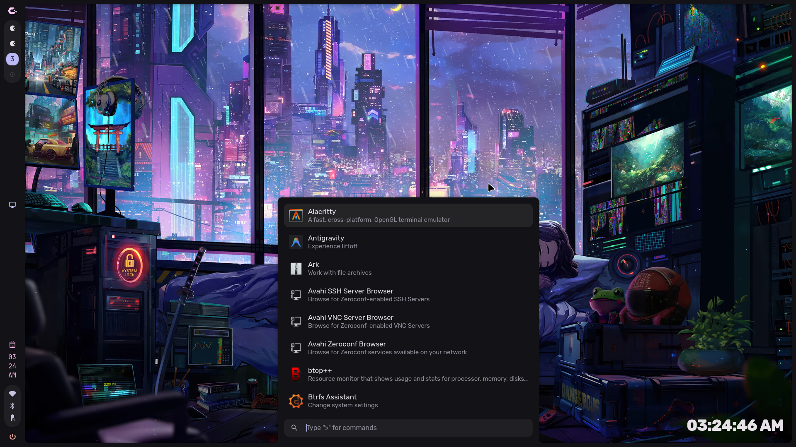
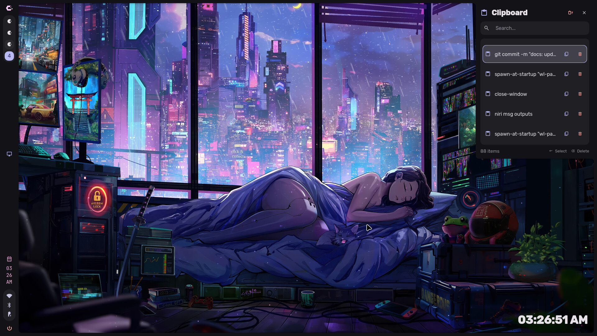
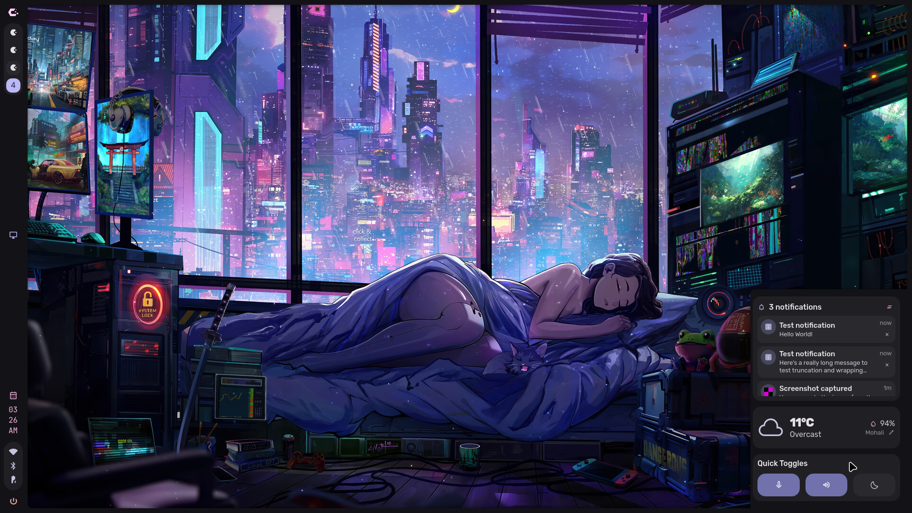
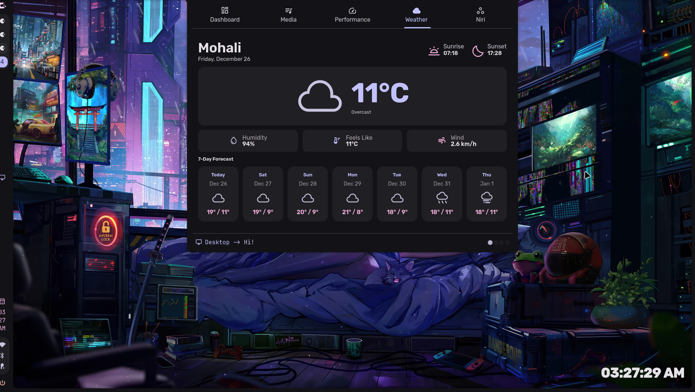
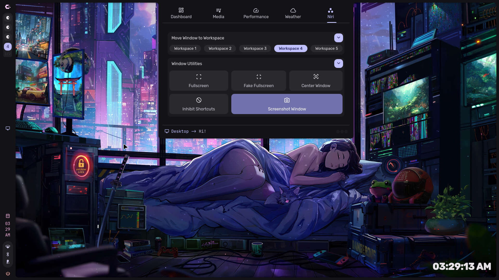

<h1 align=center>🌌 Niri-Caelestia Shell</h1>

<div align=center>


</div>


> A **Quickshell-based desktop environment** forked from [Caelestia Shell](https://github.com/caelestia-shell/caelestia-shell), adapted to run with the **Niri window manager**.
> This fork keeps the dashboard-based workflow while experimenting with new sidebar features and Niri.

<!-- <div align=center>

https://github.com/user-attachments/assets/0840f496-575c-4ca6-83a8-87bb01a85c5f

</div> -->

<div align=center>

| App Launcher | Clipboard |
|:---:|:---:|
|  |  |

| Quick Toggles | Weather |
|:---:|:---:|
|  |  |

| Niri Things |
|:---:|
|  |

</div>

> [!CAUTION]
> This is my personal fork and it's **STILL WORK IN PROGRESS**.
>
> I am still learning Quickshell and this is my first time working with it. I'm trying to learn and improve! 🚀
>
> This repo is **ONLY for the desktop shell** of the Caelestia dots. For the default Caelestia dots, head to [the main repo](https://github.com/caelestia-dots/caelestia) instead.


---

## ✨ What’s Different in This Fork?

Replaces **`Hyprland`** with **`Niri`** as the window manager.

### `Dashboard`

  - Window switch popup
    * [x] Dashboard is now opened after clicking on the popup instead of completely popping up and taking up half the screen.
    * [ ] Window decorations for pinning, hovering window, toggling fullscreen, and closing the window.

  - Experimental Niri management tab in dashboard
    * [x] Niri IPC command buttons for focused workspace
    * [ ] Needs re-design

### `Sidebar`

- Workspace bar refactor (WIP)
  * [x] Program Icon support instead of Material Font
  * [x] Switch to window by clicking
  * [x] Right click context menu
    * [ ] Allow performing Niri IPC operations in context menu
  * [x] Reorder window in workspace by drag&drop
  * [x] Grouping windows of same program
  * [x] Layout sensitive icons
  * [ ] Needs rewrite

### `Misc`
- * [x]  Niri event parser for Quickshell
- * [x]  Task manager (GPU/CPU/Memory monitoring, still improving)
- * [x]  Collapsible container UI element
- * [ ]  Application dock
- * [ ]  Searching programs in Niri overview

> [!NOTE]
> Some Caelestia features are dropped or WIP due to Niri limitations. See [ known issues](#-known-issues)

---

## 📦 Dependencies

You need both runtime dependencies and development headers.

<br>

* All dependencies in plain text:
   * `quickshell-git networkmanager fish glibc qt6-declarative gcc-libs cava libcava aubio libpipewire ddcutil brightnessctl  ttf-material-icons-git ttf-jetbrains-mono grim swappy app2unit libqalculate`

> [!NOTE]
>
> Unlike the default shell,
> [`caelestia-cli`](https://github.com/caelestia-dots/cli) is **not required for Niri**.

<details><summary> <b> Detailed info about all dependencies </b></summary>

<div align=center>


#### Core Dependencies 🖥️

| Package | Usage |
|---|---|
| [`quickshell-git`](https://quickshell.outfoxxed.me) | Must be the git version |
| [`networkmanager`](https://networkmanager.dev) | Network management |
| [`fish`](https://github.com/fish-shell/fish-shell) | Terminal |
| `glibc` | C library (runtime dependency) |
| `qt6-declarative` | Qt components |
| `gcc-libs` | GCC runtime |

#### Audio & Visual 🎵

| Package | Usage |
|---|---|
| [`cava`](https://github.com/karlstav/cava) | Audio visualizer |
| [`libcava`](https://pipewire.org) | Visualizer backend |
| [`aubio`](https://github.com/aubio/aubio) | Beat detector |
| [`libpipewire`](https://pipewire.org) | Media backend |
| [`ddcutil`](https://github.com/rockowitz/ddcutil) | Monitor brightness control |
| [`brightnessctl`](https://github.com/Hummer12007/brightnessctl) | Brightness control |

#### Fonts 🔣

| Package | Usage |
|---|---|
| [`ttf-material-icons-git`](https://fonts.google.com/icons) | Icon font |
| [`ttf-jetbrains-mono`](https://www.nerdfonts.com/font-downloads) | Monospace font |

#### Screenshot & Utilities 🧰

| Package | Usage |
|---|---|
| [`grim`](https://gitlab.freedesktop.org/emersion/grim) | Screenshot tool |
| [`swappy`](https://github.com/jtheoof/swappy) | Screenshot annotation |
| [`app2unit`](https://github.com/Vladimir-csp/app2unit) | Launch apps |
| [`libqalculate`](https://github.com/Qalculate/libqalculate) | Calculator |

#### BUILD dependencies 🏗️

| Package | Usage |
|---|---|
| [`cmake`](https://cmake.org) | Build tool |
| [`ninja`](https://github.com/ninja-build/ninja) | 🥷 |

</div>


### Manual installation

To install the shell manually, install all dependencies and clone this repo to `$XDG_CONFIG_HOME/quickshell/niri-caelestia-shell`.
Then simply build and install using `cmake`.


</details>

---

## ⚡ Installation

> [!NOTE]
> There is **NO** package manager installation support yet because... 🤔

### Manual Build

1. Install dependencies.
2. Clone the repo:

    ```sh
    cd $XDG_CONFIG_HOME/quickshell
    git clone https://github.com/Ayushkr2003/niri-caelestia-shell
    ```
3. Build:

    ```sh
    cd $XDG_CONFIG_HOME/quickshell/niri-caelestia-shell
    cmake -B build -G Ninja \
      -DCMAKE_BUILD_TYPE=Release \
      -DCMAKE_INSTALL_PREFIX=$HOME \
      -DINSTALL_QSCONFDIR=$HOME/.config/quickshell/niri-caelestia-shell
    cmake --build build
    cmake --install build
    ```
    It's trying to install into system paths (`/usr/lib/caelestia/...`),
    so grab the necessary permissions or use sudo while installing.

    If you get `VERSION is not set and failed to get from git` error, that means I forgot to tag version. You can do `git tag 1.1.1` to work around it :)

### 🔃 Updating
You can update by running `git pull` in `$XDG_CONFIG_HOME/quickshell/niri-caelestia-shell`.

```sh
cd $XDG_CONFIG_HOME/quickshell/niri-caelestia-shell
git pull
```

<br>

---

## 🚀 Usage

The shell can be started via the `quickshell -c niri-caelestia-shell -n` command or `qs -c niri-caelestia-shell -n` on your preferred terminal.
><sub> (`qs` and `quickshell` are interchangable.) </sub>


* Example line for niri `config.kdl` to launch the shell at startup:

   ```
   spawn-at-startup "quickshell" "-c" "niri-caelestia-shell" "-n"
   ```

### Custom Shortcuts/IPC

All keybinds are accessible via [Quickshell IPC msg](https://quickshell.org/docs/v0.1.0/types/Quickshell.Io/IpcHandler/).

All IPC commands can be called via `quickshell -c niri-caelestia-shell ipc call ...`

* For example:

   ```sh
   qs -c niri-caelestia-shell ipc call mpris getActive <trackTitle>
   ```

* Example shortcut in `config.kdl` to toggle the launcher drawer:
    ```sh
    Mod+Space { spawn  "qs" "-c" "niri-caelestia-shell" "ipc" "call" "drawers" "toggle" "launcher"; }
    ```

    ```sh
    Mod+Space hotkey-overlay-title="Caelestia app launcher" { spawn-sh "qs -c niri-caelestia-shell ipc call drawers toggle launcher"; }
    ```

<br>

 The list of IPC commands can be shown via `qs -c niri-caelestia-shell ipc show`.

<br>

<details><summary> <b> Ipc Commands </b></summary>

  ```sh
  ❯ qs -c niri-caelestia-shell ipc show
  target picker
    function open(): void
    function openFreeze(): void
  target quicktoggles
    function open(): void
    function toggle(): void
    function close(): void
  target idleInhibitor
    function toggle(): void
    function enable(): void
    function isEnabled(): bool
    function disable(): void
  target wallpaper
    function get(): string
    function set(path: string): void
    function list(): string
  target clipboard
    function open(): void
    function toggle(): void
    function close(): void
  target drawers
    function toggle(drawer: string): void
    function list(): string
  target controlCenter
    function open(): void
  target lock
    function isLocked(): bool
    function lock(): void
    function unlock(): void
  target mpris
    function playPause(): void
    function pause(): void
    function getActive(prop: string): string
    function play(): void
    function next(): void
    function list(): string
    function stop(): void
    function previous(): void
  target notifs
    function clear(): void
  target brightness
    function setFor(query: string, value: string): string
    function get(): real
    function set(value: string): string
    function getFor(query: string): real
  ```

</details>

<details><summary> <b> Example Niri config.kdl </b></summary>

```kdl
// Startup commands
spawn-sh-at-startup "wl-paste --type text --watch cliphist store &"
spawn-sh-at-startup "wl-paste --type image --watch cliphist store &"
spawn-sh-at-startup "qs -c niri-caelestia-shell"

environment {
    XDG_CURRENT_DESKTOP "niri"
    XDG_MENU_PREFIX "plasma-"  // Required for Dolphin file associations
    QT_QPA_PLATFORM "wayland"
    ELECTRON_OZONE_PLATFORM_HINT "auto"
    QT_QPA_PLATFORMTHEME "kde"
    QT_STYLE_OVERRIDE "Darkly"
}

binds {
    // System
    Mod+Tab repeat=false { toggle-overview; }
    Mod+Shift+E { quit; }
    Mod+Escape allow-inhibiting=false { toggle-keyboard-shortcuts-inhibit; }
    
    // Launcher
    Mod+Space repeat=false { spawn-sh "qs -c niri-caelestia-shell ipc call drawers toggle launcher"; }
    
    // Clipboard
    Mod+V repeat=false { spawn-sh "qs -c niri-caelestia-shell ipc call clipboard open"; } 
    
    // Lock screen
    Mod+L { spawn-sh "qs -c niri-caelestia-shell ipc call lock lock"; }
    
    // Region/Screenshot tools
    Mod+Shift+S { spawn-sh "qs -c niri-caelestia-shell ipc call picker open"; }
    
    // Applications (change "kitty" to your preferred terminal)
    Mod+T { spawn "kitty"; }
    Mod+Return { spawn "kitty"; }
    Super+E { spawn "dolphin"; }
    
    // Window management
    Mod+Q repeat=false { close-window; }
    Mod+D { maximize-column; }
    Mod+F { fullscreen-window; }
    Mod+Alt+Space { toggle-window-floating; }

    // Screenshots (native)
    Print { screenshot; }
    Ctrl+Print { screenshot-screen; }
    Alt+Print { screenshot-window; }
    
    // ========================================================================
    // HARDWARE KEYS - Audio, Brightness, Media
    // ========================================================================
    
    // Volume (hardware keys)
    XF86AudioRaiseVolume allow-when-locked=true { spawn-sh "wpctl set-mute @DEFAULT_AUDIO_SINK@ 0; wpctl set-volume -l 1 @DEFAULT_AUDIO_SINK@ 5%+"; }
    XF86AudioLowerVolume allow-when-locked=true { spawn-sh "wpctl set-mute @DEFAULT_AUDIO_SINK@ 0; wpctl set-volume @DEFAULT_AUDIO_SINK@ 5%-"; }
    XF86AudioMute allow-when-locked=true { spawn-sh "wpctl set-mute @DEFAULT_AUDIO_SINK@ toggle"; }
    XF86AudioMicMute allow-when-locked=true { spawn-sh "wpctl set-mute @DEFAULT_AUDIO_SOURCE@ toggle"; }

    // Brightness (hardware keys) - change eDP-1 to your monitor name by running "niri msg outputs"
    XF86MonBrightnessUp { spawn-sh "qs -c niri-caelestia-shell ipc call brightness setFor eDP-1 +5%"; }
    XF86MonBrightnessDown { spawn-sh "qs -c niri-caelestia-shell ipc call brightness setFor eDP-1 10%-"; }
    
    // Session/Power menu
    Ctrl+Alt+Delete { spawn-sh "qs -c niri-caelestia-shell ipc call drawers toggle session"; }
}
```

</details>

---

## ⚙️ Configuration

Config lives in:

```
~/.config/caelestia/shell.json
```
<details><summary> <b> Example JSON </b></summary>

```json
{
    "appearance": {
        "anim": {
            "durations": {
                "scale": 1
            }
        },
        "font": {
            "family": {
                "clock": "Rubik",
                "material": "Material Symbols Rounded",
                "mono": "JetBrains Mono Nerd Font",
                "sans": "Rubik"
            },
            "size": {
                "scale": 1
            }
        },
        "padding": {
            "scale": 1
        },
        "rounding": {
            "scale": 1
        },
        "spacing": {
            "scale": 1
        },
        "transparency": {
            "enabled": false,
            "base": 0.85,
            "layers": 0.4
        }
    },
    "general": {
        "apps": {
            "terminal": ["kitty"],
            "audio": ["pavucontrol"],
            "playback": ["mpv"],
            "explorer": ["thunar"]
        },
        "battery": {
            "warnLevels": [
                {
                    "level": 30,
                    "title": "Low battery",
                    "message": "You might want to plug in a charger",
                    "icon": "battery_android_frame_2"
                },
                {
                    "level": 20,
                    "title": "Did you see the previous message?",
                    "message": "You should probably plug in a charger <b>now</b>",
                    "icon": "battery_android_frame_1"
                },
                {
                    "level": 10,
                    "title": "Critical battery level",
                    "message": "PLUG THE CHARGER RIGHT NOW!!",
                    "icon": "battery_android_alert",
                    "critical": true
                }
            ],
            "criticalLevel": 3
        },
        "idle": {
            "lockBeforeSleep": true,
            "inhibitWhenAudio": true,
            "timeouts": [
                {
                    "timeout": 180,
                    "idleAction": "lock"
                },
                {
                    "timeout": 300,
                    "idleAction": "dpms off",
                    "returnAction": "dpms on"
                },
                {
                    "timeout": 600,
                    "idleAction": ["systemctl", "suspend-then-hibernate"]
                }
            ]
        }
    },
    "background": {
        "desktopClock": {
            "enabled": true
        },
        "enabled": true,
        "visualiser": {
            "blur": false,
            "enabled": false,
            "autoHide": true,
            "rounding": 1,
            "spacing": 1
        }
    },
    "bar": {
        "clock": {
            "showIcon": true
        },
        "dragThreshold": 20,
        "entries": [
            {
                "id": "logo",
                "enabled": true
            },
            {
                "id": "workspaces",
                "enabled": true
            },
            {
                "id": "spacer",
                "enabled": true
            },
            {
                "id": "activeWindow",
                "enabled": true
            },
            {
                "id": "spacer",
                "enabled": true
            },
            {
                "id": "tray",
                "enabled": true
            },
            {
                "id": "clock",
                "enabled": true
            },
            {
                "id": "statusIcons",
                "enabled": true
            },
            {
                "id": "power",
                "enabled": true
            }
        ],
        "persistent": true,
        "popouts": {
            "activeWindow": true,
            "statusIcons": true,
            "tray": true
        },
        "scrollActions": {
            "brightness": true,
            "workspaces": true,
            "volume": true
        },
        "showOnHover": true,
        "status": {
            "showAudio": false,
            "showBattery": true,
            "showBluetooth": true,
            "showKbLayout": false,
            "showMicrophone": false,
            "showNetwork": true,
            "showLockStatus": true
        },
        "tray": {
            "background": false,
            "compact": false,
            "iconSubs": [],
            "recolour": false
        },
        "workspaces": {
            "label": "  ",
            
            
            "activeIndicator": true,
            "activeLabel": "󰮯",
            "activeTrail": false,
            "groupIconsByApp": true,
            "groupingRespectsLayout": false,
            "windowRighClickContext": true,
            "label": "⊙",
            "occupiedBg": true,
            "occupiedLabel": "󰮯",
            "showWindows": false,
            "shown": 4,
            "windowIconImage": false,
            "focusedWindowBlob": false,
            "windowIconGap": 0,
            "windowIconSize": 30
        },
        "excludedScreens": [""],
        "activeWindow": {
            "inverted": false
        }
    },
    "border": {
        "rounding": 10,
        "thickness": 10
    },
    "dashboard": {
        "enabled": true,
        "dragThreshold": 50,
        "mediaUpdateInterval": 500,
        "showOnHover": true
    },
    "launcher": {
        "actionPrefix": ">",
        "dragThreshold": 50,
        "vimKeybinds": false,
        "enableDangerousActions": false,
        "maxShown": 8,
        "maxWallpapers": 9,
        "specialPrefix": "@",
        "useFuzzy": {
            "apps": false,
            "actions": false,
            "schemes": false,
            "variants": false,
            "wallpapers": false
        },
        "showOnHover": false
    },
    "lock": {
        "recolourLogo": false
    },
    "notifs": {
        "actionOnClick": false,
        "clearThreshold": 0.3,
        "defaultExpireTimeout": 5000,
        "expandThreshold": 20,
        "openExpanded": false,
        "expire": true
    },
    "osd": {
        "enabled": true,
        "enableBrightness": true,
        "enableMicrophone": false,
        "hideDelay": 2000
    },
    "paths": {
        "mediaGif": "root:/assets/bongocat.gif",
        "sessionGif": "root:/assets/kurukuru.gif",
        "wallpaperDir": "~/Pictures/Wallpapers",
        "wallpaper": "~/Pictures/Wallpapers/default.jpg"
    },
    "services": {
        "audioIncrement": 0.1,
        "maxVolume": 1.0,
        "defaultPlayer": "Spotify",
        "gpuType": "",
        "playerAliases": [{ "from": "com.github.th_ch.youtube_music", "to": "YT Music" }],
        "weatherLocation": "New York",
        "useFahrenheit": false,
        "useTwelveHourClock": true,
        "smartScheme": true,
        "visualiserBars": 45
    },
    "session": {
        "dragThreshold": 30,
        "enabled": true,
        "vimKeybinds": false,
        "commands": {
            "logout": ["loginctl", "terminate-user", ""],
            "shutdown": ["systemctl", "poweroff"],
            "hibernate": ["systemctl", "hibernate"],
            "reboot": ["systemctl", "reboot"]
        }
    },
    "sidebar": {
        "dragThreshold": 80,
        "enabled": true
    },
    "utilities": {
        "enabled": true,
        "maxToasts": 4,
        "toasts": {
            "audioInputChanged": true,
            "audioOutputChanged": true,
            "capsLockChanged": true,
            "chargingChanged": true,
            "configLoaded": true,
            "dndChanged": true,
            "gameModeChanged": true,
            "kbLayoutChanged": true,
            "numLockChanged": true,
            "vpnChanged": true,
            "nowPlaying": false
        },
        "vpn": {
            "enabled": false,
            "provider": [
                {
                    "name": "wireguard",
                    "interface": "your-connection-name",
                    "displayName": "Wireguard (Your VPN)"
                }
            ]
        }
    }
}

```

</details>

<details><summary> <b> Example Nix Home Manager </b></summary>

I don't have nix, plz help :D

```nix
{
  programs.niri-caelestia-shell = {
    enable = true;
    with-cli = true;
    settings.theme.accent = "#ffb86c";
  };
}
```

</details>

### 🎭 PFP/Wallpapers
The profile picture for the dashboard is read from the file `~/.face`, so to set
it you can copy your image to there or set it via the dashboard. **It's not a directory.**

The wallpapers for the wallpaper switcher are read from `~/Pictures/Wallpapers`
by default. To change it, change the wallpapers path in `~/.config/caelestia/shell.json`.

To set the wallpaper, you can use the app launcher command `> wallpaper`.


---

## 🧪 Known Issues

1. Multi-monitor support is currently hardcoded :(
2. Task manager has no Intel GPU support.
3. Workspace bar needs refactoring at the moment.
4. Picker (screenshot tool) window grabbing is WIP due to Niri limitations.
5. Focus grabbing for Quickshell windows (power menu, task manager, settings) behaves awkwardly because of Niri limitations.
6. Quickshell may occasionally crash because of upstream issues (it re-opens automagically)
7. I'm not happy that you have to build it to be able to use it, so I might revert.
8. Some dependencies aren't actually required but I keep them because the original repo still has them.
9. I haven't touched theming, be cautious.

---

## ❓ FAQ

**Q: Can I theme it?**
A: Yes, via `shell.json` (or Nix options if you use Home Manager).

**Q: Why does my task manager Intel GPU messed-up?**
A: GPU monitoring is limited; Intel isn’t supported yet.

**Q: Why does it take so long for you to update?**
A: Civil unrest in my country 😥

---

## 🙏 Credits

* [Quickshell](https://github.com/quickshell/quickshell) – Core shell framework
* [Caelestia](https://github.com/caelestia-shell/caelestia-shell) – Original project
* [Niri-Caelestia-Shell](https://github.com/jutraim/niri-caelestia-shell) – Niri adaptation this fork is based on
* [Niri](https://github.com/YaLTeR/niri) – Window manager backend
* All upstream contributors :)

---

## 📈 Useless chart

[](https://star-history.com/#Ayushkr2003/niri-caelestia-shell&Date)
